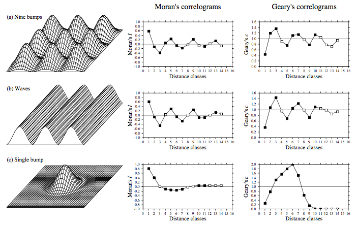
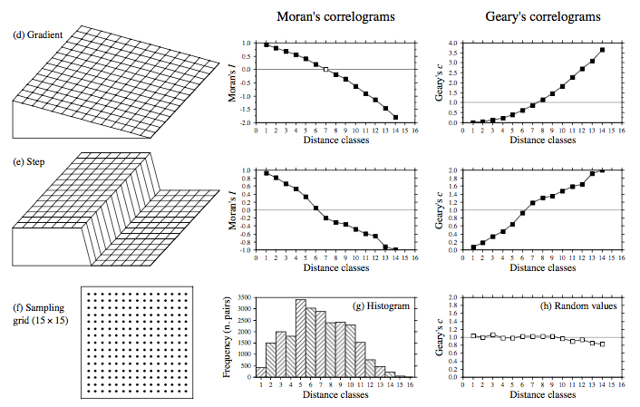

```{r setup, include=FALSE}
library(knitr)
library(ncf); library(pgirmess); library(spdep)
library(vegan)

knitr::opts_chunk$set(echo = T, warning = F, fig.align = "center", message = F, error = F, cache = T)
```


Buscando como fazer correlogramas no R para analisar alguns dados espaciais, eu criei este roteiro com algumas informações, pacotes e funções que encontrei. Este não pretende ser um roteiro completo, e se você tiver críticas, dúvida e sugestões, não hesite em me 
<a href="http://melinaleite.weebly.com/" target="blank"> contactar.</a>

Inicio com uma explicação teórica superficial do que é autocorrelação espacial, para depois apresentar os pacotes no R com as funções que a analisam. Utilizo sempre exemplos em **Ecologia**, assim como as principais referências.

# Autocorrelação Espacial

Quando se pretende fazer algum tipo de análise com dados que são espacialmente arranjados, uma das primeiras coisas que se faz é verificar e quantificar o grau de **autocorrelação espacial** (ou apenas correlação espacial) da variável de interesse existente entre as unidades amostrais vizinhas.

Nesse tutorial vamos explorar as formas de se calcular e inspecionar a autocorrelação espacial para uma variável através dos coeficientes de autocorrelação e dos gráficos correlogramas associados. Os **correlogramas** são gráficos que associam os valores dos coeficientes de autocorrelação a cada intervalo de distância nos dado e são importantes para examinar padrões de autocorrelação espacial nos dados ou nos resíduos de um modelo. Eles mostram quão correlacionados são pares de observações espaciais quando se aumenta a distância (lag) entre eles.

O coeficiente **I de Moran (Moran I)** é um dos principais coeficientes de autocorrelação espacial proposto, e pode ser computado para cada classe de distância $d$:

$$ I(d) = [\frac{n}{W_{d}}] \frac{ \sum_{i=1}^n \sum_{j=1}^{n}w_{ij}(d)(x_i - \bar{x})(x_j - \bar{x})}{\sum_{i=1}^n (x_i - \bar{x})^2} $$

Onde:

- $n$ é o número de unidades  
- $w_{ij}(d)$ é a matriz de conectividade da classe de distância $d$ (também conhecida como matriz de pesos)  
- $W_{d}$ é a soma de todos os $w_{ij}(d)$, sendo o número de pares de locais por classe de distância  
- $x_i$ e $x_j$ são os valores da variável de interessse na unidades (locais) $i$ e $j$  

Portanto, o valor do índice de autocorrelação para a distância $d$ é a média dos valores de autocorrelação espacial para cada local em toda a área de estudo, também conhecido como uma estimativa global isotrópica média da autocorrelação espacial [@fortin_spatial_2005]. 

O índice varia entre **-1** e **1**, sendo autocorrelação positiva indicadas por valores positivos e autocorrelação negativa por valores negativos. O valor esperado para ausência de autocorrelação espacial está próximo a 0. Porém, o valor do índice pode ficar maior que 1 ou menor que -1 em casos onde existem poucos pares de locais em certas classes de distâncias e/ou os dados parecem não ser estacionários ou normalmente distribuídos (presença de valores extremos). Críticas ao uso do Moran I e alternativas (como o coeficiente **C de Geary**) podem ser vistas em [@fortin_spatial_2005].

Duas questões práticas relacionadas a serem resolvidas são: **1) o valor da distância** a ser escolhida para corresponder a uma classe e 2) o **número de classes de distância serem calculados**. Mais classes com distâncias pequenas significam mais resolução, porém menos pares por classe e, portanto menor poder para cada teste [@legendre_numerical_2012]. 

O Moran I pode ser aplicado tanto em dados tipo raster (*lattice*) quanto em dados de locais pontuais não uniformemente distanciados (*point patterns*).

Os correlogramas são analisados principalmente pelos seus formatos, e estes podem dar uma ideia da estrutura espacial dos dados. Retirei a figura abaixo de @legendre_numerical_2012 para mostrar alguns exemplos de correlogramas resultantes de certas estruturas espaciais (não deixe de ver a referência original).

  



## Condições para testar a presença de correlação espacial

As condição de **estacionaridade de segunda-ordem** deve ser levada em conta [@borcard_numerical_2011]. Essa condição diz que a média da variável e sua covariância espacial são as mesmas em toda a área de estudo, ou seja, que a variância seja finita. A condição nos diz que a variação espacial nos dados deveria ser adequadamente descrita pela mesma e única função de correlação espacial em todas as porçoes da área de estudo.

As estimativas de significância de cada valor de autocorrelação espacial estimado em cada classe de distância podem ser testadas usando procedimentos de aleatorização - função `correlog` do pacote `ncf`, ou um teste de aproximação a uma distribuição normal [@fortin_spatial_2005] - função `correlog` do pacote `pgirmess`. A condição de **normalidade** pode ser relaxada quando se testa com aleatorização.

Entretanto, os testes são problemáticos quanto à falta de independência dos dados, já que o mesmo conjunto de dados é usado para estimar o índice em várias classes de distância. Um dos procedimentos mais usados para lidar com múltiplos testes é a **correção de bonferroni sequencial** [@fortin_spatial_2005]; também conhecida como correção de *Holmes*) que ajusta o nível de probabilidade para cada distância $\alpha^´(d)$, dividindo $\alpha$ (o nível de significância adotado) pelo número de classes de distâncias $k$, de maneira sequencial:

$$ \alpha^´(d) = \frac{\alpha}{d}$$

Os testes de significância nos permite determinar quais valores de coeficientes podem ser usados para interpretar a estrutura espacial dos dados. **É importante verificar se a função sendo usada para calcular a autocorrelação espacial implementa ou não algum tipo de correção para os valores de significância obtidos.**

Com os valores dos coeficientes e os testes de significância para cada classe de distância dos dados, podemos construir os **correlogramas**. Dado que a maioria dos dados ecológicos mostram algum grau de autocorrelação positiva, em curtas distâncias os valores de autocorrelação são geralmente significativos e positivos. A forma do correlograma pode ser usado para caracterizar o padrão espacial [@fortin_spatial_2005]. Uma tendência no correlograma, indo de valores positivos para negativos gradativamente é indicativo de um gradiente nos dados. Quando os valores em curta distância são positivos e então, a certa distância apresenta flutuações ao redor do valor esperado, é provável que exista um padrão em manchas (*patchiness*).


# Pacotes no R para autocorrelação e correlogramas espaciais

Existem muitos pacotes que calculam os índices de autocorrelação espacial e plotam correlogramas de diferentes maneiras. Vamos explorar alguns utilizando os dados de comunidades de ácaros orobatídeos disponíveis no pacote `vegan` e também utilizados em @borcard_numerical_2011 [capítulo 7]:

**Dados**

```{r}
library(vegan)
data(mite.xy) # coordenadas espaciais
data(mite.env) # variáveis ambientais
```

```{r, echo = F}
kable(head(mite.env), caption = "**Tabela 1**. Primeiras linhas da tabela de dados mite.env com as variáveis ambientais coletadas em cada local")
```


Plotando as coordenadas dos locais, junto com a variável `SubsDens` de densidade de substrato.
```{r, fig.height=8, fig.width=6, fig.cap="**Figura 2**. Coordenadas dos locais amostrados para comunidades de orobatídeos. As cores representam o gradiente nos valores da variável ambiental densidade de substrato."}

# para as cores
rbPal <- colorRampPalette(c('red','blue'))
mite.env$Col <- rbPal(10)[as.numeric(cut(mite.env$SubsDens,breaks = 10))]

plot(x = mite.xy[,1], y = mite.xy[,2], xlab = "coordenadas X", 
     ylab = "coordeandas Y", col = mite.env$Col, pch = 16, cex = 2)
```


## Pacote `ncf`

O pacote `ncf`(Spatial Nonparametric Covariance Functions), contém diversas funções para aplicações espaciais. Os correlogramas podem ser feitos principalmente com duas funções.:

A função `correlog` aplica o Moran I para dados univariados, é simples e permite calcular o **nível de significância dos índices por reamostragem** (argumento `resamp`). Nesta função você especifica a coordenada X e Y, o valor da variável de interesse em cada local e o incremento das classes de distância (o intervalo que vai corresponder a cada classe de distância). A reamostragem pode ser demorada dependendo do número de locais na sua amostra.

```{r, fig.cap="**Figura 3**. Os círculos em preto representam as classes de distância significativamente diferentes de zero."}
library(ncf)
ncf.cor <- ncf::correlog(mite.xy[,1],mite.xy[,2], mite.env$SubsDens, 
                    increment = 0.7, resamp = 1000, quiet = T)
plot(ncf.cor)
abline(h = 0, lty = 2)
```

A documentação da função (`help(correlog)`) não indica se os valores de significância estimados (coluna `p` no objeto) possuem algum tipo de correção para múltiplos testes. Parece que não.

O pacote também tem a função `spline.correlog` que calcula a autocorrelação espacial de maneira contínua através de um estimador não paramétrico de covariância espacial resultando em um correlograma com curva <a href="https://pt.wikipedia.org/wiki/Spline" target = "blank">spline</a>. Essa é uma opção para evitar calcular a autocorrelação espacial em distâncias fixas (classes). A significância das estimativas são baseadas em um envelope de intervalo de confiança produzido por técnica de *boostrapping*.

```{r, fig.cap="**Figura 4**. Correlograma spline."}
spline.cor <- spline.correlog(mite.xy[,1],mite.xy[,2], mite.env$SubsDens, 
                    resamp = 1000, quiet = T)
plot(spline.cor)
```

As funções acima também lidam com dados multivariados, fazendo **correlogramas de Mantel**. No pacote, existem ainda outras funções que plotam correlogramas mais específicos a certos tipos de dados, por exemplo `correlog.nc`. 


## Pacote `pgirmess`

O pacote `pgirmess` é um pacote com funções gerais para análises de dados em Ecologia, que possui a função `correlog`[^2]  que calcula o Moran I e também o coeficiente **C de Geary**. O coeficiente C de Geary se parece muito com o Moran I, mas é usado quando se quer evitar o uso de médias, pois ele mede a diferença entre valores de uma variável com as localizações vizinhas, desta forma o grau de autocorrelação espacial é baseado nas diferenças em função da distância (em classes) [@fortin_spatial_2005].

[^2]: cuidado para não ter problemas ao carregar os dois pacotes com mesmo nome de função, a função `correlog` será aquela do pacote carregado por último. Para evitar esse problema você pode usar `pgirmess::corelog()` ou `ncf::correlog()`.

Nessa função você tem que especificar o número de classes pretendido, ao invés do incremento de distância.
```{r, fig.cap="**Figura 5**. Correlograma da função `pgirmess::correlog`"}
library(pgirmess)

pgi.cor <- correlog(coords = mite.xy, z = mite.env$SubsDens, method = "Moran",
                    nbclass = 14)

pgi <- as.data.frame(pgi.cor)
plot(pgi$dist.class, pgi$coef, ylab = "correlation", 
        xlab = "distance (mean-of-class)")
lines(pgi$dist.class, pgi$coef)
points(pgi$dist.class[pgi$p.value < 0.025], pgi$coef[pgi$p.value < 
        0.025], pch = 21, bg = "black")
abline(h = 0, lty = 2)
```

Diferentemente da função `correlog` do pacote `ncf`, a função `correlog` do pacote `pgirmess` usa a **aproximação à normal para calcular o nível de significância** e, portanto, é mais rápida do que a anterior. Porém, também não especifica em sua documentação a existência de correção dos valores de significância para as múltiplas comparações.

No coeficiente **Geary C**, os valores da autocorrelação espacial pode ir de 0 (maior valor de correlação positiva) a 2 (forte autocorrelação negativa), sendo que valores próximos a 1 indicam ausência de autocorrelação. 

```{r, fig.cap="**Figura 6**. Correlograma de Geary C."}
pgi.geary <- correlog(coords = mite.xy, z = mite.env$SubsDens, method = "Geary",
                    nbclass = 14)
pgi <- as.data.frame(pgi.geary)

plot(pgi$dist.class, pgi$coef, ylab = "correlation", 
        xlab = "distance (mean-of-class)")
lines(pgi$dist.class, pgi$coef)
points(pgi$dist.class[pgi$p.value < 0.025], pgi$coef[pgi$p.value < 
        0.025], pch = 21, bg = "black")
abline(h = 1, lty = 2)
```


## Pacote `spdep`

O pacote `spdep` (Spatial Dependence) acompanha o livro de @bivand_applied_2008 [Applied spatial data analyis with R] e é muito mais abrangente e flexível, contendo diferentes formas de se calcular os valores dos coeficientes de autocorrelação. Entretanto, é um pacote com uma curva de aprendizado mais inclinada, já que grande parte das explicações das funções provém da leitura do livro. Ele pode ser útil em casos em que existem estruturas complexas de vizinhança, pois também calcula os **índices locais de autocorrelação espacial** [@fortin_spatial_2005].

Seguindo os exemplos em @bivand_applied_2008 e @borcard_numerical_2011, vamos usar as formas mais simples de se calcular os coeficientes e plotar os correlogramas.

Para computar os coeficientes de correlação espacial, primeiro construimos uma matriz de distâncias geográficas entre locais (objeto de classe `nb`). Essas distâncias serão convertidas em classes $d$. No nosso exemplo, definimos vizinhaça como menor ou igual a 0.7 m usando a função `dnearneigh()`. 

Antes disso, vamos usar a <a href="http://adn.biol.umontreal.ca/~numericalecology/numecolR/" target="blank"> função plot.links </a> escrita por P. Legendre que acompanha o material suplementar do livro de @borcard_numerical_2011 para plotar as conexões entre vizinhos para a distância escolhida.[^3]

[^3]: essa função foi modificada por mim para incluir a opção de se plotar ou não o texto referente ao local.

```{r}
source("plot.links.r")
plot.links(mite.xy, thresh = 0.7, text = F)
```

Com esse plot podemos ver as ligações entre vizinhanças que aconteceram numa distância máxima de 0,7.

Criando o objeto de distância entre vizinhos:
```{r}
library(spdep)
vizinho <- dnearneigh(as.matrix(mite.xy), 0, 0.7)
summary(vizinho)
```


Agora calculando e plotando o correlograma com a função `sp.correlogram` e usando a relação de distância criada acima.

```{r, fig.cap="**Figura 7**. Correlograma criado com a função `spdep::sp.correlogram`."}
corre.sp <- sp.correlogram(vizinho, mite.env$SubsDens, order = 14, method = "I",
                            zero.policy = TRUE)
print(corre.sp, p.adj.method = "holm") # nível significância corrigido
plot(corre.sp,  p.adj.method = "holm") # nível significância corrigido
```

O argumento `order` indica o número de classes de distância que serão calculados e plotados. O número de ordens máximo é limitado a um certo número de pares de observações. Se quisermos limitar a distância máxima para o cálculo da autocorrelação espacial, podemos limitar o n´úmero de ordens que queremos. Na figura, as barras verticais indicam duas vezes o desvio padrão da estimativa.

Esta função também permite o cálculo através do coeficiente Geary C (`method = "C"`). Por padrão, a variância será cálculada por aleatorização (`randomization = TRUE`), caso contrário por aproximação à normal.

Para mostrar os resultados com a função `print`, utilizamos o argumento que indica qual o método de **ajuste dos valores de significância para múltiplas comparações**. Utilizamos o método de correção de _Holms_ já comentado anteriormente, que consiste em aplicar a correção de bonferroni sequencialmente (veja a documentação da função `p.adjust` para mais esclarecimentos).

Um bom exemplo de aplicação das funções de autocorrelação espacial, usando o pacote `spdep`,  é o de artigo @jaffe_reconciling_2016 (não deixe de conferir os códigos em R no material suplementar). Neste artigo, os autores utilizam diferentes funções, como `moran.test`, `moran.mc`, testando diferentes escalas espaciais na qual a autocorrelação espacial pudesses estar atuando nos dados. Ou seja, **é muito recomendável que façamos testes com diferentes classes de distância** para entender melhor padrões espaciais que possam emergir dos dados.

<!-- 
O script do Jaffe faz na mão os Morans I, pega as estimativas, teste, ICs e faz um ggplot.
Para isso fez um for. Mas o resultado gráfico é bem legal.
-->


## Comparando os resultados das funções

```{r, echo=F, results="hide"}
corre2 <- as.data.frame(print(corre.sp, p.adj.method = "holm"))
```

```{r, echo=F, fig.cap = "**Figura 8**. Plotando os correlogramas das funções utilizadas, exceto para `spline.correlog`."}
plot(ncf.cor$mean.of.class, ncf.cor$correlation, xlab = "Distance",
     ylab = "Moran I")
lines(ncf.cor$mean.of.class, ncf.cor$correlation)
points(ncf.cor$mean.of.class[ncf.cor$p < 0.025], ncf.cor$correlation[ncf.cor$p < 
        0.025], pch = 21, bg = "black")
abline(h = 0, lty = 2)

pgi <- as.data.frame(pgi.cor)
points(pgi$dist.class, pgi$coef, ylab = "correlation", 
        xlab = "distance (mean-of-class)", col = "red")
lines(pgi$dist.class, pgi$coef, col = "red")
points(pgi$dist.class[pgi$p.value < 0.025], pgi$coef[pgi$p.value < 
        0.025], pch = 21, bg = "red")


xi <- ncf.cor$mean.of.class
points(y = corre.sp$res[,1], x = xi, col = "blue")
lines(y = corre.sp$res[,1], x = xi, col = "blue")
points(y = corre.sp$res[corre2$`Pr(I) two sided` < 0.05][1], xi[corre2$`Pr(I) two sided` < 0.05][1], pch = 21, bg = "blue")

legend(x = 0.1, y = -0.3, legend = c("ncf", "pgirmess", "spdep"), 
       fill = c("black", "red", "blue"))
```

Apesar de apresentarem um formato parecido, as diferentes funções utilizadas para construir os correlogramas diferem em alguns pontos. Minha interpretação é que a principal diferença entre as funções seja devido à forma com que cada uma calcula as distâncias (lags) entre os dados, ou seja, na função `pgirmess::correlog` e `spdep::sp.correlogram` nós indicamos o número de classes e a função divide os dados em classes de igual tamanho e isso não necessariamente corresponde exatamente ao valor do incremento que escolhemos na função `ncf::correlog`.


# Formas mais complexas de autocorrelação espacial

## Correlogramas direcionais

Até agora consideramos os coeficientes de autocorrelação espacial e correlogramas em todas as direções, ou seja, assumindo um **processo isotrópico** (o mesmo em todas as direções). Entretanto, existem processos ecológicos que pode gerar padrõe espaciais que variam com a direção, como por exemplo em gradientes ambientais [@fortin_spatial_2005]. Para determinar o grau de **anisotropia** num padrão espacial, a autocorrelação espacial pode ser calculada levando em consideração tanto a distância (usando uma matriz de classes de distância) quanto a orientação (usando uma matriz de classes de ângulos). Assim, podem ser computados autocorrelações espaciais para vários ângulos de direção e os resultados plotados em um **correlograma direcional**.

No R, eu ainda não encontrei pacote ou função que implementa os correlogramas direcionais para dados univariados. Entretanto para dados de comunidades (matriz de abundâncias/presenças por local), existe o pacote [`CommunityCorrelogram`](https://cran.r-project.org/web/packages/CommunityCorrelogram/CommunityCorrelogram.pdf) que possui uma função para calcular o correlograma com opção de anisotropia.


## Autocorrelações locais

Quanto maior é a extensão espacial de dados ecológicos, maior a probabilidade de se violar a premissa de estacionariedade [@fortin_spatial_2005]. Até agora nós lidamos apenas com estatísticas globais, ou seja, coeficientes que são calculados para todo o conjunto de dados, capazes de detectar tendências em ampla escala. Entretanto, estas estatísticas podem estar mascarando possíveis padrões de heterogeneidade espacial local. Enquanto os valores médios de dependência espacial das estatísticas globais são úteis para detectar tendências em um processo, estes se tornam ineficientes quando vários processos agem em diferentes intensidades em diferentes partes da área de estudo.

As estatísticas locais propostas são modificações das estatísticas globais, como o coeficiente Moran I, calculadas em cada local $i$ baseado apenas nos vizinhos locais $j$.

Explicações sobre autocorrelações locais e as funções do pacote `spdep` para calcula-las podem ser encontradas em @bivand_applied_2008 [Capítulo 9].


# Referências 

<a href="http://www.petrkeil.com/?p=1050" target="blank"> Keil, P. 2013. Spatial correlograms in R: a mini overview.</a>
